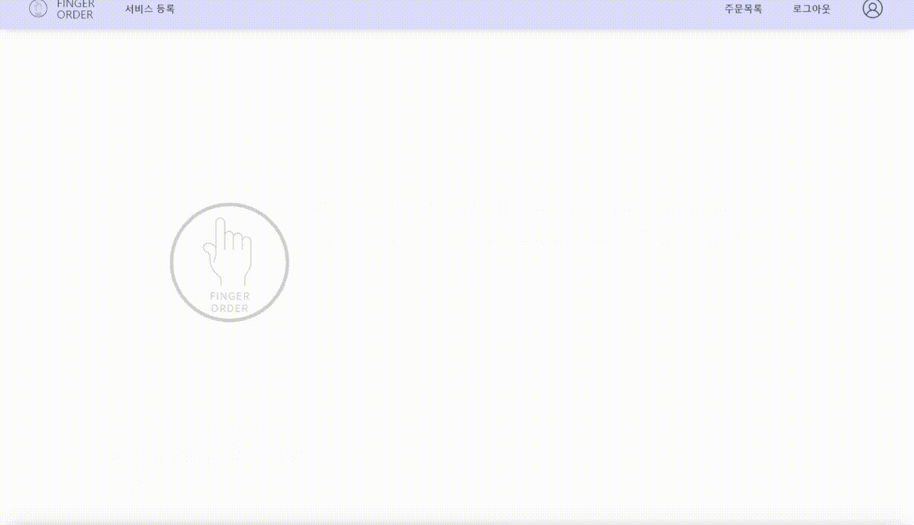

# 핑거오더 (FingerOrder) - Frontend

## 프로젝트 소개

### 기획 배경

-   키오스크의 평균 설치비용은 `150만원 가량`으로 적지 않은 금액이다.
-   가게마다 `사용법이 다른` 키오스크로 인해 불편함을 느낀다.
-   키오스크의 설치 수가 적은 매장의 경우 `손님이 많으면 줄을 서서 기다리는 경우`가 생기고, `뒷 사람의 눈치를 보며` 주문을 여유롭게 할 수 없다.

### 해결 컨셉

-   `QR 코드`를 이용한 모바일 키오스크 기능을 구현해 개인의 스마트폰으로 주문을 한다.
-   스타벅스 사이렌 오더와 같은 프랜차이즈 모바일 오더 서비스을 일반음식점에도 제공한다.

### 기대 효과

-   테이블마다 QR 코드를 부착해 고객은 `개인의 스마트폰`으로 편하게 자리에서 주문을 할 수 있다.
-   사장님의 입장에서는 비싼 `키오스크 대여비와 인건비를 줄일 수 있다.`
-   사용자 입장에서 비교적 익숙한 모바일 형태의 사용법으로 `좀 더 편리하게` 주문을 할 수 있다.

## 디렉토리 구조

```
Root
├─components	            # Header, Footer, Modal 컴포넌트
├─data			    # mock data
├─pages		            # 각 페이지
├─public		    # 페이지에 사용된 이미지
├─states		    # Recoil에 사용되는 변수 파일
├─styles		    # SCSS 스타일
│   ├─components
│   └─pages
└─ ...
```

## 주요 페이지 소개

### Home 화면



-   핑거오더 서비스를 소개
-   6개의 Section으로 분할

### 로그인 및 회원가입

-   이메일, 비밀번호로 회원가입
-   카카오 로그인 가능 (구현 예정)

### 마이페이지

-   비밀번호 수정, 회원 탈퇴
-   유저가 등록한 매장 조회, 수정, 삭제, QR코드 출력, 리뷰 페이지 이동 가능

### 서비스 등록

-   매장 등록, 카테고리 등록, 메뉴 등록 가능
-   카테고리 수정, 삭제 가능
-   메뉴 수정, 삭제 가능

### 주문 목록

-   실시간 주문 확인 가능
-   주문 내역 페이지 이동 가능
-   매출 내역 페이지 이동 가능

### QR코드

-   유저가 지정한 매장의 테이블 수 만큼 QR코드가 생성
-   각 테이블마다 다르거나 같게(같을 경우 주문번호로 운영) 설정하여 QR코드 생성 가능

## 배포 주소

https://fingerorder.vercel.app/

## QR코드를 통한 URL 접속 페이지

https://github.com/welcome5group/frontend_order

## 백엔드

https://github.com/welcome5group/backend
